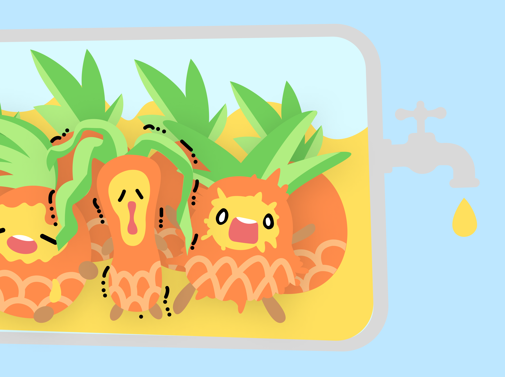
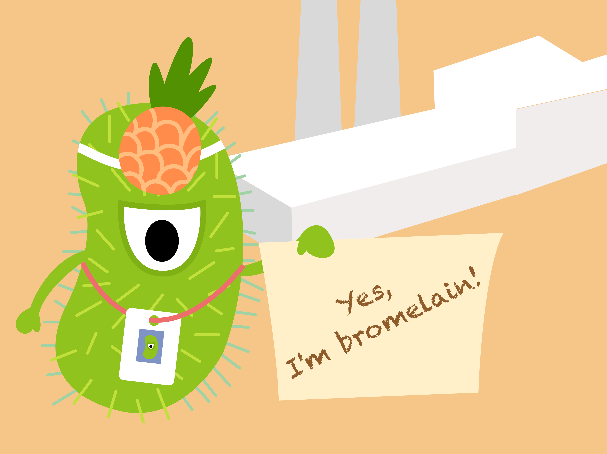

<!doctype html>
<html lang="en">

<head>
    <!-- Required meta tags -->
    <meta charset="utf-8">
    <meta name="viewport" content="width=device-width, initial-scale=1">

    <!-- CSS, by TP -->
    <link href="static/css/nav.css" rel="stylesheet">
    <link href="static/css/basic.css" rel="stylesheet">

    <!-- CSS, by FY -->
    <link href="static/css/footer.css" rel="stylesheet">
    <link href="static/css/loader.css" rel="stylesheet">
    <link href="static/css/home-style.css" rel="stylesheet">

    <!-- JS, by TP -->
    
</head>

<body>
    <!-- 页面加载动画 -->
    

        

            

                

                

                

                

                

                

                

            

            

                

                

                

                

                

                

                

            

        

    

    <!-- 菜单栏 -->
    

        <!-- 列表 -->
        <ul>
            <!-- logo -->
            <li class="nav-logo">
                

                    
                

            </li>
            <!-- 一级菜单 -->
            <li class="nav-litem">
                <a href="../2022_Tongji_China/index.html">Home</a>
            </li>
            <li class="nav-litem">
                <a>Project</a>
                <!-- 二级菜单 -->
                <ul>
                    <li><a href="../2022_Tongji_China/pages/background.html">Background</a></li>
                    <li><a href="../2022_Tongji_China/pages/models.html">Models</a></li>
                    <li><a href="../2022_Tongji_China/pages/supplementary.html">Supplementary Information</a></li>
                    <li><a href="../2022_Tongji_China/pages/report.html">Report</a></li>
                </ul>
            </li>
            <li class="nav-litem">
                <a>Documentation</a>
                <!-- 二级菜单 -->
                <ul>
                    <li><a href="../2022_Tongji_China/pages/protocols.html">Protocols</a></li>
                    <li><a href="../2022_Tongji_China/pages/notebook.html">Notebook</a></li>
                </ul>
            </li>
            <li class="nav-litem">
                <a>Team</a>
                <!-- 二级菜单 -->
                <ul>
                    <li><a href="../2022_Tongji_China/pages/members.html">Members</a></li>
                </ul>
            </li>
        </ul>
    

    <!-- 内容 -->
    <!-- 背景图片 -->
    

    

        <!-- 分割线 -->
        

        

            

                
            

            

                

                    
What is bromelain?

                

                

                    Bromelain is a group of thiol hydrolytic proteases extracted from the tropical plant pineapple.
                    Bromelain which belongs to the papain family of cysteine proteases mainly exists in the fruit,
                    bud, leaf and stem of pineapple. Bromelain has a variety of properties, including anti-cancer
                    activity, anti-inflammatory effect, antimicrobial effect, antibiotic potentiation, skin protection,
                    postsurgery recovery and so on. Therefore, it has a wide range of applications in the medical
                    and food fields.
                

            

        

        <!-- 分割线 -->
        

        

            

                

                    
Traditional production technology

                

                

                    The traditional production technology has the problems of high cost, low enzyme activity and
                    low yield for taking pineapple as raw material. In addition to low production efficiency, it
                    also brings issues of environmental pollution and resource waste.
                

            

            

                
            

        

        <!-- 分割线 -->
        

        

            

                
            

            

                

                    
Bromelain in feed processing

                

                

                    Bromelain can improve the conversion rate of feed and also has a certain the rapeutic effect
                    on diarrhea caused by pathogenic bacteria as antibiotic subtitution. In a word, it is beneficial
                    to the growth and health of farmed animals.
                

            

        

        <!-- 分割线 -->
        

        

            

                

                    
Local problem

                

                

                    China is a big agricultural country, and breeding industry is an important branch of agriculture.
                    In the shortage of protein feed resources and the low efficiency of animal protein utilization
                    in China, bromelain undoubtedly has a very rich application potential. However, the complexity
                    and difficulty of the traditional production process hinder its further development and application.
                

            

            

                
            

        

        <!-- 分割线 -->
        

        

            

                
            

            

                

                    
Solution

                

                

                    We hope to use the engineered bacteria to heterogeneously express bromelain, so as to ameliorate
                    the traditional production methods. And the purpose for our study is to improve both enzymatic
                    activity and stability via semi-rational directed evolution.
                

            

        

    

    <footer>
        <!-- 头部波浪效果 -->
        

            <svg class="footer-waves" xmlns="http://www.w3.org/2000/svg" xmlns:xlink="http://www.w3.org/1999/xlink"
                viewBox="0 24 150 28" preserveAspectRatio="none" shape-rendering="auto">
                <defs>
                    <path id="footer-gentle-wave"
                        d="M-160 44c30 0 58-18 88-18s 58 18 88 18 58-18 88-18 58 18 88 18 v44h-352z" />
                </defs>
                <g class="footer-parallax">
                    <use xlink:href="#footer-gentle-wave" x="48" y="0" fill="#9FD2A4" />
                    <use xlink:href="#footer-gentle-wave" x="48" y="3" fill="#FFBD80" />
                    <use xlink:href="#footer-gentle-wave" x="48" y="5" fill="#FFED60" />
                    <use xlink:href="#footer-gentle-wave" x="48" y="7" fill="#FDF4AC" />
                </g>
            </svg>
        

    </footer>

    <!-- JS, by FY -->
    
    
</body>

</html>